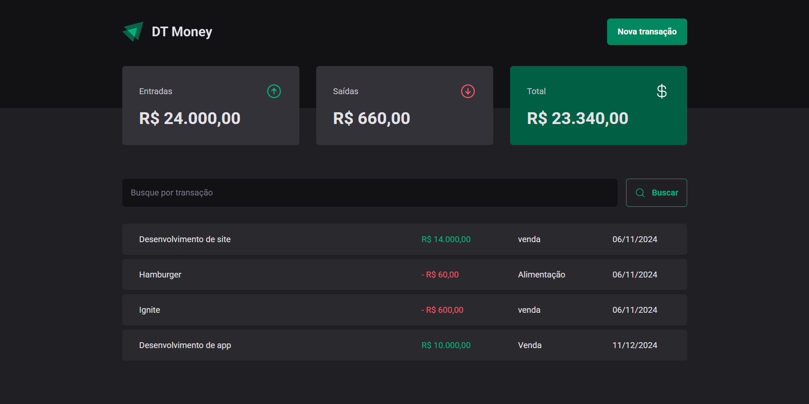

# Dt Money




## Tecnologias 🚀

**•Vite**

**•React**

**•Typescript**

**•styled-component**


## Instalação 🛠

 Clone o repositório
```bash
 $ git clone https://github.com/Hribeir6/dt-money
```

Vá para o diretório do projeto
```bash 
 $ cd dt-money
```

Instale as dependências
```bash
  $ npm install
```

Inicie o servidor
```bash
 $ npm run dev
 $ npx json-server server.json
```
